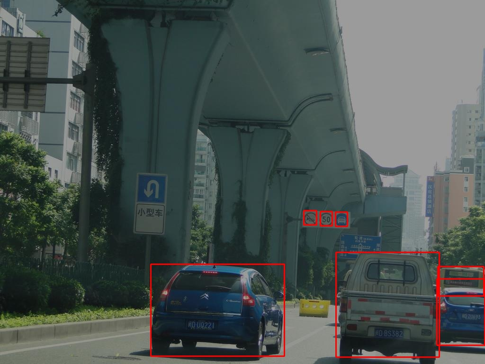
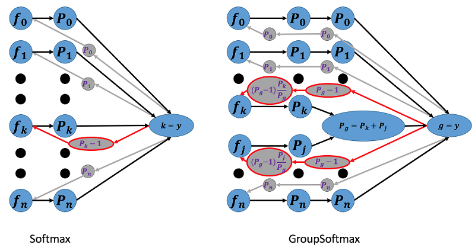
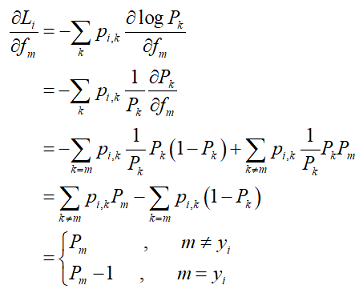

# GroupSoftmax-SimpleDet

---
## GroupSoftmax Cross Entropy Loss Function
GroupSoftmax cross entropy loss function is implemented for training with multiple different benchmark datasets. We trained a 83 classes detection model by using COCO and CCTSDB.

---
## GroupSoftmax交叉熵损失函数
在工业界的实际生产环境中，经常会面临如下四个问题：
- 在不重新标注原有数据的情况下，对新的标注数据，增加某些新的类别
- 在不重新标注原有数据的情况下，对新的标注数据，修改原有的类别标准，比如将某个类别拆分成新的几个类别
- 已标注数据集中，出现概率较高的类别一般属于简单样本，对新的数据只标注出现概率较低的类别，能够显著降低标注成本
- 在标注大型目标检测数据集时，只标注矩形框，而不选择类别属性，能够有效降低标注成本

为了解决上述四个问题，我们提出了 **_GroupSoftmax_** 交叉熵损失函数，如下图所示，与 **_Softmax_** 交叉熵损失函数相比， **_GroupSoftmax_** 交叉熵损失函数允许类别 **_K_** 和类别 **_j_** 发生合并，形成一个新的组合类别 **_g_** ，当训练样本 **_y_** 的真实标签为组合类别 **_g_** 时，也能够计算出类别 **_K_** 和类别 **_j_** 的对应梯度，完成网络权重更新。理论上， **_GroupSoftmax_** 交叉熵损失函数能够兼容任意数量、任意标注标准的多个数据集联合训练。


 **VS** 

从公式也可以看出， **_GroupSoftmax_** 损失函数是 **_Softmax_** 损失函数的一种推广，一种更复杂也更加灵活的表达，可以自由的发生类别合并。当群组类别 **_g_** 中只包含 **_m_** 单独一个类别时， **_GroupSoftmax_** 损失函数退化为 **_Softmax_** 损失函数。为了验证 **_GroupSoftmax_** 交叉熵损失函数的有效性，我们利用 **_GroupSoftmax_** 交叉熵损失函数在COCO和CCTSDB数据集上进行了联合训练，得到了一个83类检测器。有趣的是，模型不仅有83类检测效果，在coco_minival2014测试集上的表现比原来80类检测器反而会好一些。也就是说我们利用了一个与COCO无关的CCTSDB数据集，在相同参数下，Faster RCNN算法的检测效果由原来的38.6提高到了39.3，提高了0.7个点。我们同时训练了一个83类Trident*模型，6个epoch训练周期在coco_minival2014测试集上mAP指标为44.0，进一步验证了 **_GroupSoftmax_** 交叉熵损失函数的有效性。从理论上而言， **_GroupSoftmax_** 交叉熵损失函数能够支持任意标注标准的数据集进行联合训练。
|Model|Backbone|Head|GroupSoftmax|Num Classes|Train Schedule|FP16|AP|AP50|AP75|APs|APm|APl|Link|
|-----|--------|----|------------|-----------|--------------|----|--|----|----|---|---|---|----|
|Faster-SyncBN|R101v2-C4|C5-256ROI|no|80|1X|no|38.6|-|-|-|-|-|[model](https://simpledet-model.oss-cn-beijing.aliyuncs.com/faster_r101v2c4_c5_256roi_syncbn_1x.zip)|
|Faster-SyncBN|R101v2-C4|C5-256ROI|yes|83|1X|yes|39.3|59.9|42.3|21.0|44.1|53.3|-|
|Trident*|R101v2-C4|C5-128ROI|yes|83|1X|yes|44.0|64.9|48.4|29.0|47.8|57.6|-|

### USAGE
 **_GroupSoftmax_** 用法参考[groupsoftmax_faster_r101v2c4_c5_256roi_syncbn_1x.py](./config/groupsoftmax_faster_r101v2c4_c5_256roi_syncbn_1x.py)中的GroupParam设置，下面举例说明用法。

#### 样例1
假设有3个数据集：**数据集A、数据集B、数据集C**，它们的标注细节情况如下：
- **数据集A**，标注了4个类别的cls和box，分别为 **{行人、公交车、非机动车、牛}**
- **数据集B**，标注了5个类别的cls和box，分别为 **{行人、公交车、电动车、自行车、狗}** ，其中电动车和自动车，为数据集A中的非机动车类别拆分成的两个子类
- **数据集C**，标注6个类别的box，包括 **{行人、公交车、电动车、自动车、狗、牛}**，但是没有标注出类别cls信息

考虑上述的3个数据集，我们能够定义一个最精细的6类检测任务，类别分别为 **{行人、公交车、电动车、自行车、牛、狗}** ，想要通过上述的3个数据集联合训练得到一个6分类的检测模型，应该修改RPN网络和Head网络中的分类数量，以及对应的group_id信息。对于某个数据集中未标注的类别，group_id为0，意味着等同于背景类，本质是某个类别未标注可以理解为将某个类别标注为背景。网络修改细节如下：

- RPN网络：考虑如上分类情况，RPN应该为4分类任务，分别为：{ 背景、前景1、前景2、前景3 }。其中 **前景1={行人、公交车、非机动车、电动车、自行车}，前景2={牛}，前景3={狗}**。需要特别说明的是，在数据集C中，因为所有类别（也就是所有前景）的box都标注出来了，但是没有细分类别id，所以在分类任务中的group_id信息都为1，也可以都为2，计算loss时所有group_id相等的类别会组合成一个新的组合类别，也即在数据集C中 **{前景1、前景2、前景3}** 会组成一个 **前景group类别** 共同计算loss和对应的梯度。
    ```python
    rpnvx = np.array([0, 1, 2, 3], dtype=np.float32)    # rpn 4 classes
    rpnva = np.array([0, 1, 2, 0], dtype=np.float32)    # rpn group_id of DATASET A
    rpnvb = np.array([0, 1, 0, 3], dtype=np.float32)    # rpn group_id of DATASET B
    rpnvc = np.array([0, 1, 1, 1], dtype=np.float32)    # rpn group_id of DATASET C
    ```
- Head网络：如上所述，考虑背景最终为7分类任务，分别为 **{背景(0)、行人(1)、公交车(2)、电动车(3)、自行车(4)、牛(5)、狗(6)}** 。需要指出的是，在数据集A中，由于 **{电动车、自行车}** 是以 **{非机动车}** 的标准来标注的，所以这2个类别的group_id都为3，也可以都为4，这2个类别在计算loss时会发生组合。同理，在数据集C中由于没有细分类别id，所以6个类别的group_id都为1，计算loss时这6个类别会组合成一个新的类别。
    ```python
    boxvx = np.array([0,  1,  2,  3,  4,  5,  6], dtype=np.float32)     # box 7 classes
    boxva = np.array([0,  1,  2,  3,  3,  5,  0], dtype=np.float32)     # box group_id of DATASET A
    boxvb = np.array([0,  1,  2,  3,  4,  0,  6], dtype=np.float32)     # box group_id of DATASET B
    boxvc = np.array([0,  1,  1,  1,  1,  1,  1], dtype=np.float32)     # box group_id of DATASET C
    ```
- 修改RPN网络的类别映射方法gtclass2rpn，将真实类别id映射为RPN网络中的类别
    ```python
    def gtclass2rpn(gtclass):
        gtclass[gtclass < 5]  = 1       #前景1
        gtclass[gtclass == 5] = 2       #前景2
        gtclass[gtclass == 6] = 3       #前景3
        return gtclass
    ```

#### 样例2
如果CCTSDB中同时标注了person类别和3类交通标注，也即CCTSDB和COCO中都标注了person类别，则应该做出改动的地方有三个：
- RPN的分类任务应该由3分类修改为4分类，因为此时有4种情况，分别为： **{ 背景、前景1、前景2、前景3 }** ，其中 **前景1** 为COCO和CCTSDB中都标注了的person， **前景2** 为COCO中的其他79个类别， **前景3** 为CSTSDB中的3类交通标志。所以应该将GroupParam中的rpnvx信息，由原来的：
    ```python
    rpnv0 = np.array([0, 1, 2], dtype=np.float32)     # rpn 3 classes
    rpnv1 = np.array([0, 1, 0], dtype=np.float32)     # COCO benchmark
    rpnv2 = np.array([0, 0, 2], dtype=np.float32)     # CCTSDB benchmark
    ```
    修改为：
    ```python
    rpnv0 = np.array([0, 1, 2, 3], dtype=np.float32)     # rpn 4 classes
    rpnv1 = np.array([0, 1, 2, 0], dtype=np.float32)     # COCO benchmark
    rpnv2 = np.array([0, 1, 0, 3], dtype=np.float32)     # CCTSDB benchmark
    ```
    前景1在COCO和CCTSDB中都进行标注了。而前景3在COCO中未标注，所以前景3在COCO的样本中会与背景类组成一个group组类别。而前景2在CCTSDB中未标注，所以前景2在CCTSDB的样本中会与背景类组成一个group组类别。本质是某个类别未标注可以理解为将某个类别标注为背景。

- 修改RPN网络的类别映射方法gtclass2rpn，原来是3分类网络，类别映射为： **{0 ==> 0, [1,2,...,80] ==> 1, [81,82,83] ==> 2}** 。现在是4分类网络，类别映射应该修改为： **{0 ==> 0, 1 ==> 1, [2,3,...,80] ==> 2, [81,82,83] ==> 3}** 。对应的gtclass2rpn方法应该由原来的：
    ```python
    def gtclass2rpn(gtclass):
        class_gap = 80
        gtclass[gtclass > class_gap] = -1
        gtclass[gtclass > 0] = 1
        gtclass[gtclass < 0] = 2
        return gtclass
    ```
    修改为：
    ```python
    def gtclass2rpn(gtclass):
        class_gap = 80
        gtclass[gtclass > class_gap] = -1
        gtclass[gtclass == 1] = 1
        gtclass[gtclass > 1] = 2
        gtclass[gtclass < 0] = 3
        return gtclass
    ```
- 在Head网络中，跟原来唯一的区别是CCTSDB中标注了person类别，因为person类别在COCO中类别id为1，所以对应的，在CCTSDB的boxv2中，id为1的类别也由原来的0修改为1，因为已经标注了，不再与背景类0组成一个group进行训练。修改之后如下：
    ```python
    # box 83 classes
    boxv0 = np.array([0,  1,  2,  3,  4,  5,  6,  7,  8,  9,  10, 11, 12, 13, 14, 15, \
                          16, 17, 18, 19, 20, 21, 22, 23, 24, 25, 26, 27, 28, 29, 30, \
                          31, 32, 33, 34, 35, 36, 37, 38, 39, 40, 41, 42, 43, 44, 45, \
                          46, 47, 48, 49, 50, 51, 52, 53, 54, 55, 56, 57, 58, 59, 60, \
                          61, 62, 63, 64, 65, 66, 67, 68, 69, 70, 71, 72, 73, 74, 75, \
                          76, 77, 78, 79, 80, 81, 82, 83], dtype=np.float32)
    #COCO benchmark
    boxv1 = np.array([0,  1,  2,  3,  4,  5,  6,  7,  8,  9,  10, 11, 12, 13, 14, 15, \
                          16, 17, 18, 19, 20, 21, 22, 23, 24, 25, 26, 27, 28, 29, 30, \
                          31, 32, 33, 34, 35, 36, 37, 38, 39, 40, 41, 42, 43, 44, 45, \
                          46, 47, 48, 49, 50, 51, 52, 53, 54, 55, 56, 57, 58, 59, 60, \
                          61, 62, 63, 64, 65, 66, 67, 68, 69, 70, 71, 72, 73, 74, 75, \
                          76, 77, 78, 79, 80, 0,  0,  0 ], dtype=np.float32)
    #CCTSDB benchmark
    boxv2 = np.array([0,  1,  0,  0,  0,  0,  0,  0,  0,  0,  0,  0,  0,  0,  0,  0,  \
                          0,  0,  0,  0,  0,  0,  0,  0,  0,  0,  0,  0,  0,  0,  0,  \
                          0,  0,  0,  0,  0,  0,  0,  0,  0,  0,  0,  0,  0,  0,  0,  \
                          0,  0,  0,  0,  0,  0,  0,  0,  0,  0,  0,  0,  0,  0,  0,  \
                          0,  0,  0,  0,  0,  0,  0,  0,  0,  0,  0,  0,  0,  0,  0,  \
                          0,  0,  0,  0,  0,  81, 82, 83], dtype=np.float32)
    ```


---
## SimpleDet - A Simple and Versatile Framework for Object Detection and Instance Recognition
### Major Features

- FP16 training for memory saving and up to **2.5X** acceleration
- Highly scalable distributed training available **out of box**
- Full coverage of state-of-the-art models including FasterRCNN, MaskRCNN, CascadeRCNN, RetinaNet, **[TridentNet](./models/tridentnet)**, **[NASFPN](./models/NASFPN)** and **[EfficientNet](./models/efficientnet)**
- Extensive feature set including **large batch BN**, **loss synchronization**, **automatic BN fusion**, deformable convolution, soft NMS, multi-scale train/test
- Modular design for coding-free exploration of new experiment settings

### Recent Updates
- Add RPN test (2019.05.28)
- Add [NASFPN](https://github.com/TuSimple/simpledet/tree/master/models/NASFPN) (2019.06.04)
- Add new ResNetV1b baselines from GluonCV (2019.06.07)
- Add Cascade R-CNN with FPN backbone (2019.06.11)
- Speed up FPN up to 70% (2019.06.16)
- Update [NASFPN](https://github.com/TuSimple/simpledet/tree/master/models/NASFPN) to include larger models (2019.07.01)
- Automatic BN fusion for fixed BN training, saving up to 50% GPU memory (2019.07.04)
- Speed up MaskRCNN by 80% (2019.07.23)
- Update MaskRCNN baselines (2019.07.25)
- Add EfficientNet and DCN (2019.08.06)

### Setup
#### Install
SimpleDet contains a lot of C++ operators not in MXNet offical repo, so one has to build MXNet from scratch. Please refer to [INSTALL.md](./doc/INSTALL.md) more details

#### Preparing Data
SimpleDet requires groundtruth annotation organized as following format
```
[
    {
        "gt_class": (nBox, ),
        "gt_bbox": (nBox, 4),
        "flipped": bool,
        "h": int,
        "w": int,
        "image_url": str,
        "im_id": int,

        # this fields are generated on the fly during test
        "rec_id": int,
        "resize_h": int,
        "resize_w": int,
        ...
    },
    ...
]
```

Especially, for experimenting on coco datatet, one can organize coco data in
```
data/
    coco/
        annotations/
            instances_train2014.json
            instances_valminusminival2014.json
            instances_minival2014.json
            image_info_test-dev2017.json
        images/
            train2014
            val2014
            test2017
```

and run the helper script to generate roidb
```bash
python3 utils/generate_roidb.py --dataset coco --dataset-split train2014
python3 utils/generate_roidb.py --dataset coco --dataset-split valminusminival2014
python3 utils/generate_roidb.py --dataset coco --dataset-split minival2014
python3 utils/generate_roidb.py --dataset coco --dataset-split test-dev2017
```

#### Deploy dependency and compile extension
1. setup mxnext, a wrapper of mxnet symbolic API
```bash
cd $SIMPLEDET_DIR
git clone https://github.com/RogerChern/mxnext
```
2. run make in simpledet directory to install cython extensions

#### Quick Start

```bash
# train
python3 detection_train.py --config config/detection_config.py

# test
python3 detection_test.py --config config/detection_config.py
```


### Project Design
#### Model Zoo
Please refer to [MODEL_ZOO.md](./MODEL_ZOO.md) for available models

#### Code Structure
```
detection_train.py
detection_test.py
config/
    detection_config.py
core/
    detection_input.py
    detection_metric.py
    detection_module.py
models/
    FPN/
    tridentnet/
    maskrcnn/
    cascade_rcnn/
    retinanet/
mxnext/
symbol/
    builder.py
```
#### Config
Everything is configurable from the config file, all the changes should be **out of source**.

#### Experiments
One experiment is a directory in **experiments** folder with the same name as the config file.
> E.g. r50_fixbn_1x.py is the name of a config file

```
config/
    r50_fixbn_1x.py
experiments/
    r50_fixbn_1x/
        checkpoint.params
        log.txt
        coco_minival2014_result.json
```

#### Models
The `models` directory contains SOTA models implemented in SimpletDet.

#### How is Faster-RCNN built
**Simpledet** supports many popular detection methods and here we take [**Faster-RCNN**](https://arxiv.org/abs/1506.01497) as a typical example to show how a detector is built.

- *Preprocessing*. The preprocessing methods of the detector is implemented through `DetectionAugmentation`.
  - Image/bbox-related preprocessing, such as `Norm2DImage` and `Resize2DImageBbox`.
  - Anchor generator `AnchorTarget2D`, which generates anchors and corresponding anchor targets for training RPN.
- *Network Structure*. The training and testing symbols of Faster-RCNN detector is defined in `FasterRcnn`. The key components are listed as follow:
  - *Backbone*. `Backbone` provides interfaces to build backbone networks, *e.g.* ResNet and ResNext.
  - *Neck*. `Neck` provides interfaces to build complementary feature extraction layers for backbone networks, *e.g.* `FPNNeck` builds Top-down pathway for [Feature Pyramid Network](https://arxiv.org/abs/1612.03144).
  - *RPN head*. `RpnHead` aims to build classification and regression layers to generate proposal outputs for RPN. Meanwhile, it also provides interplace to generate sampled proposals for the subsequent R-CNN.
  - *Roi Extractor*. `RoiExtractor` extracts features for each roi (proposal) based on the R-CNN features generated by `Backbone` and `Neck`.
  - *Bounding Box Head*. `BboxHead` builds the R-CNN layers for proposal refinement.

#### How to build a custom detector
The flexibility of **simpledet** framework makes it easy to build different detectors. We take [**TridentNet**](https://arxiv.org/abs/1901.01892) as an example to demonstrate how to build a custom detector simply based on the **Faster-RCNN** framework.

- *Preprocessing*. The additional processing methods could be provided accordingly by inheriting from `DetectionAugmentation`.
  - In TridentNet, a new `TridentAnchorTarget2D` is implemented to generate anchors for multiple branches and filter anchors for scale-aware training scheme.
- *Network Structure*. The new network structure could be constructed easily for a custom detector by modifying some required components as needed and
  - For TridentNet, we build trident blocks in the `Backbone` according to the descriptions in the paper. We also provide a `TridentRpnHead` to generate filtered proposals in RPN to implement the scale-aware scheme. Other components are shared the same with original Faster-RCNN.


### Distributed Training
Please refer to [DISTRIBUTED.md](./doc/DISTRIBUTED.md)


### Contributors
Yuntao Chen, Chenxia Han, Yanghao Li, Zehao Huang, Yi Jiang, Naiyan Wang


### License and Citation
This project is release under the Apache 2.0 license for non-commercial usage. For commercial usage, please contact us for another license.

If you find our project helpful, please consider cite our tech report.
```
@article{chen2019simpledet,
  title={SimpleDet: A Simple and Versatile Distributed Framework for Object Detection and Instance Recognition},
  author={Chen, Yuntao and and Han, Chenxia and Li, Yanghao and Huang, Zehao and Jiang, Yi and Wang, Naiyan and Zhang, Zhaoxiang},
  journal={arXiv preprint arXiv:1903.05831},
  year={2019}
}
```
